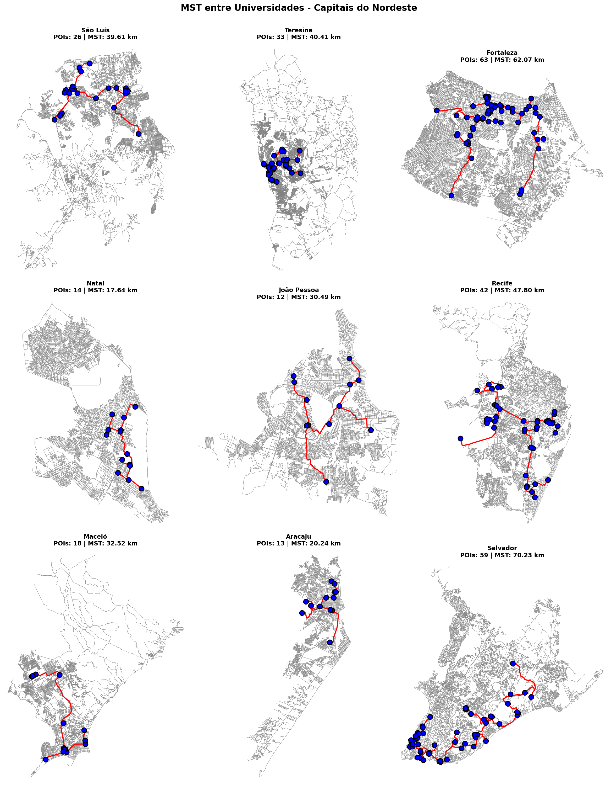

# Trabalho 2 Unidade 2 – A\* + MST

## Análise de Conectividade entre Universidades nas Capitais do Nordeste

### 📋 Objetivo

Estimar quantos quilômetros são suficientes para interligar universidades por vias reais nas 9 capitais do Nordeste brasileiro, utilizando o algoritmo A\* para rotas ótimas e Árvore Geradora Mínima (MST) via Kruskal para minimizar o comprimento total da rede.

### 🎯 Metodologia

1. **Modelagem do Grafo Viário**: Utilizamos OSMnx para obter grafos viários reais das 9 capitais do Nordeste
2. **POIs Selecionados**: Universidades (`amenity: university`) - diferente do notebook base que usou hospitais
3. **Projeção**: Grafos projetados para UTM para métricas precisas em metros
4. **Algoritmo A\***: Calculamos rotas ótimas entre todos os pares de POIs usando distância de Manhattan como heurística
5. **MST (Kruskal)**: Construímos árvore geradora mínima sobre o grafo completo de POIs para minimizar comprimento total

### 🗺️ Capitais Analisadas

**Nordeste Brasileiro (9 capitais):**

- 🏛️ São Luís (MA)
- 🏛️ Teresina (PI)
- 🏛️ Fortaleza (CE)
- 🏛️ Natal (RN)
- 🏛️ João Pessoa (PB)
- 🏛️ Recife (PE)
- 🏛️ Maceió (AL)
- 🏛️ Aracaju (SE)
- 🏛️ Salvador (BA)

### 📊 Resultados

| Cidade            | Nº POIs   | MST Total (km) | Nº Arestas MST | Média por POI (km/POI) | Média por Aresta (km/aresta) |
| :---------------- | :-------- | :------------- | :------------- | :--------------------- | :--------------------------- |
| Salvador          | 59.00     | 70.23          | 58.00          | 1.19                   | 1.21                         |
| Fortaleza         | 63.00     | 62.07          | 62.00          | 0.99                   | 1.00                         |
| Recife            | 42.00     | 47.80          | 41.00          | 1.14                   | 1.17                         |
| Teresina          | 33.00     | 40.41          | 32.00          | 1.22                   | 1.26                         |
| São Luís          | 26.00     | 39.61          | 25.00          | 1.52                   | 1.58                         |
| Maceió            | 18.00     | 32.52          | 17.00          | 1.81                   | 1.91                         |
| João Pessoa       | 12.00     | 30.49          | 11.00          | 2.54                   | 2.77                         |
| Aracaju           | 13.00     | 20.24          | 12.00          | 1.56                   | 1.69                         |
| Natal             | 14.00     | 17.64          | 13.00          | 1.26                   | 1.36                         |
| **MÉDIA GERAL**   | **31.11** | **40.11**      | **30.11**      | **1.47**               | **1.55**                     |
| **DESVIO PADRÃO** | **19.69** | **17.68**      | **19.69**      | **0.47**               | **0.54**                     |

### 🎯 Análise Crítica: Por que certas cidades exigem mais/menos km?

As diferenças observadas no comprimento total da MST entre as capitais (17.64 km em Natal vs 70.23 km em Salvador) resultam de uma interpretação entre fatores reais e artefatos metodológicos. Primeiramente, existe um fator matemático a ser considerado: cidades com mais POIs naturalmente produzem MSTs maiores, pois há mais conexões necessárias (Salvador: 59 POIs vs Natal: 14 POIs). Entretanto, a métrica km/POI revela que esse não é o único fator — João Pessoa, com apenas 12 universidades, apresenta 2.54 km/POI, enquanto Fortaleza, com 63, tem apenas 0.99 km/POI.
Fatores geográficos reais explicam parte dessa variação: Salvador é a segunda maior capital nordestina com 159,3 km² (área urbana), enquanto Natal possui área urbana mais compacta. A morfologia urbana importa — cidades territorialmente maiores tendem a MSTs maiores que cidades pequenas. Limitações metodológicas comprometem essas conclusões: (1) o viés de cobertura do OpenStreetMap é grande, como evidenciado pelos dados do MEC(Censo da Educação Superior 2023), João Pessoa possui mais de 30 instituições de ensino superior, não apenas 12; (2) a escolha da tag `amenity=university` é arbitrária e inconsistentemente aplicada entre cidades — algumas marcam cada prédio separadamente, outras apenas sedes administrativas, como por exemplo a UFRN, que no mapa marca três pontos em volta do campus que são os prédios da EMUFRN, a ECT e a ESURFN.
A escolha de POIs é o problema central: não estamos medindo a distribuição real de instituições de ensino superior, mas sim a qualidade/completude do mapeamento colaborativo em cada cidade. Fortaleza pode ter comunidade OSM mais ativa que mapeia exaustivamente, inflando artificialmente seu número de POIs.
Conclusão: os resultados refletem mais a heterogeneidade dos dados OSM do que diferenças urbanísticas genuínas entre as capitais nordestinas.

### 🛠️ Tecnologias Utilizadas

- **OSMnx**: Obtenção e manipulação de grafos viários
- **NetworkX**: Implementação de A\* e algoritmo de Kruskal
- **Matplotlib**: Visualizações
- **NumPy & Pandas**: Análise e processamento de dados

### 📹 Vídeo de Apresentação

[Link do vídeo demonstrativo](https://drive.google.com/file/d/10DJmdEQ7yFTcJRPwaUKG3M7xozfSYTwm/view?usp=sharing)
