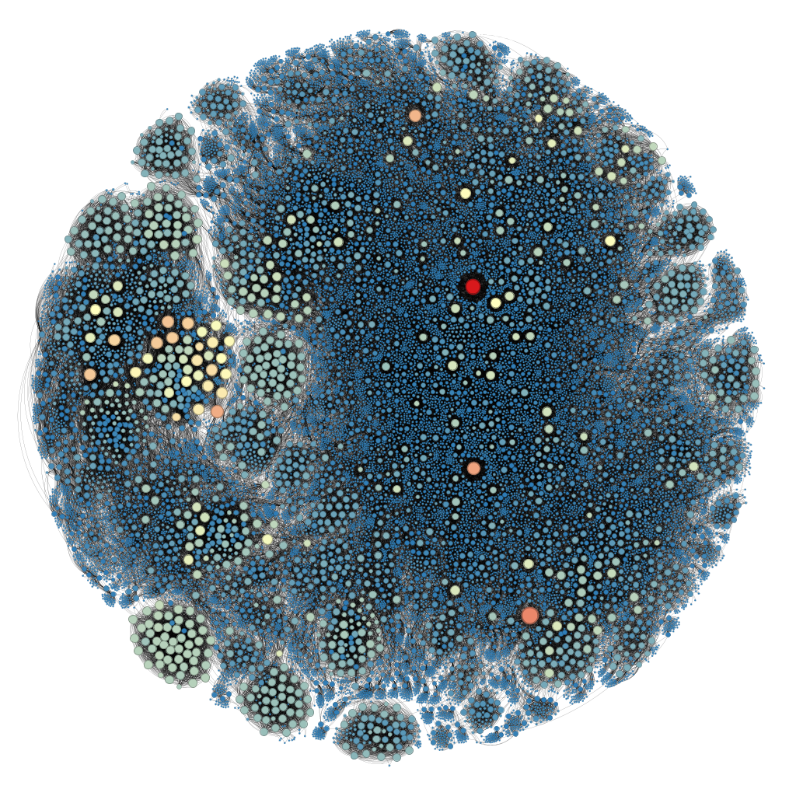
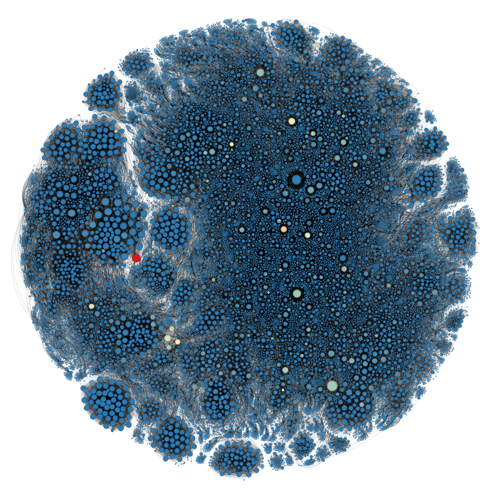
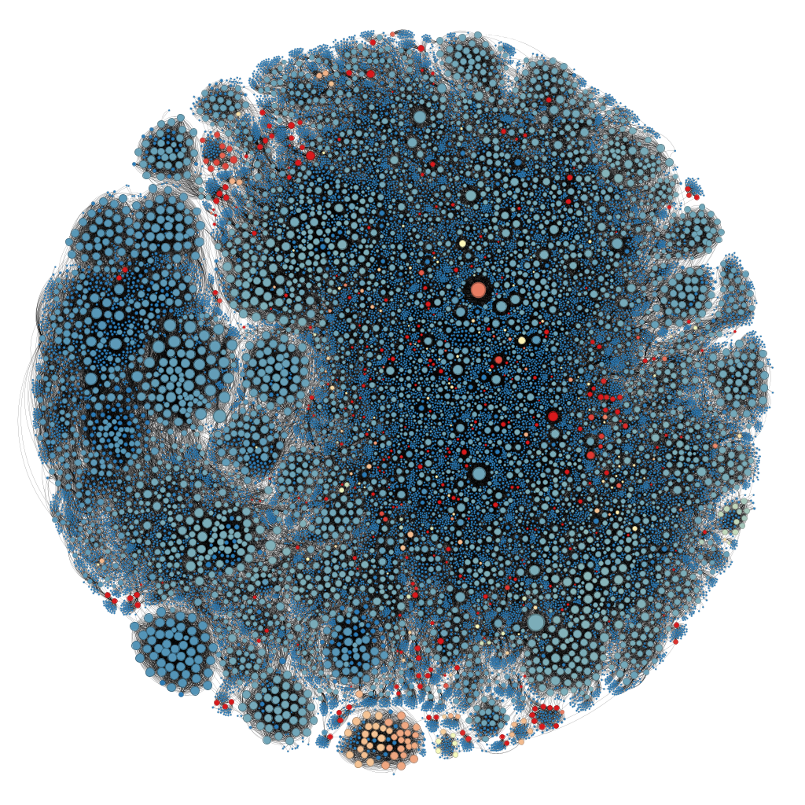
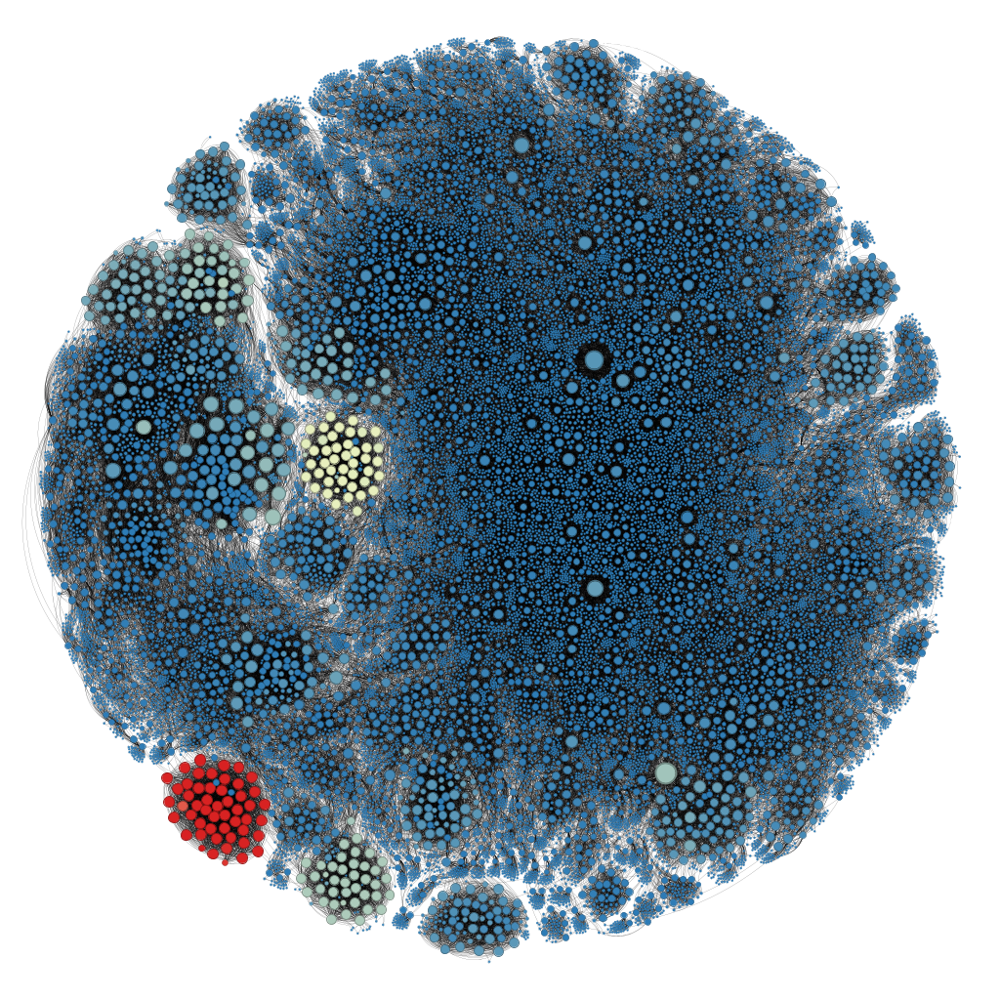
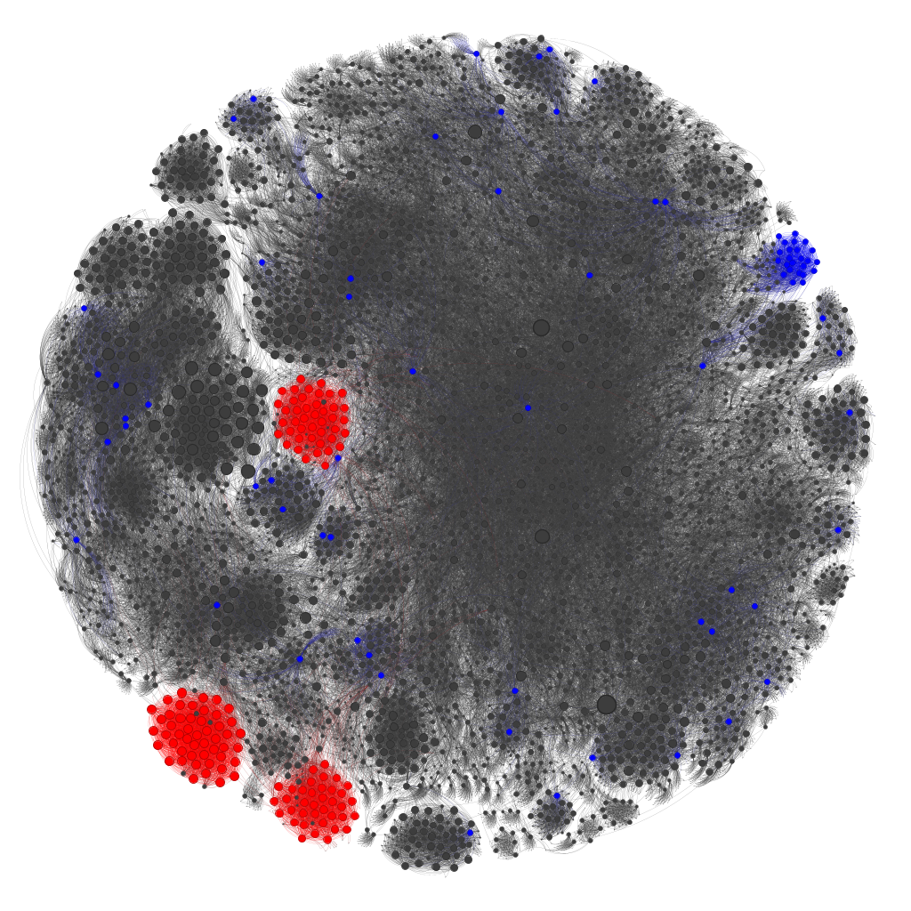
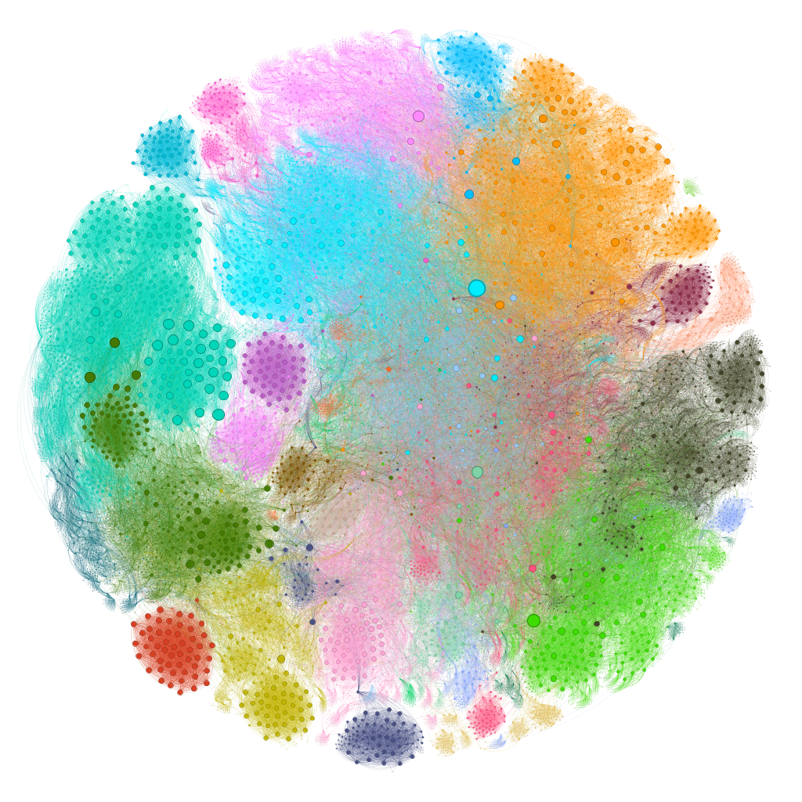

# Wikipedia Merged Network

## Visão Geral

Este projeto apresenta um **estudo de caso de Análise de Redes** que constrói uma **rede unificada (merged network) de páginas da Wikipedia** a partir de **múltiplas páginas iniciais (_seeds_)**. A abordagem utiliza _snowballing_ controlado por heurísticas para coletar links, mesclar sub-redes, eliminar duplicatas e explorar propriedades estruturais da rede resultante.

O notebook principal documenta todo o pipeline: **coleta de dados → construção da rede → limpeza → truncagem → análise exploratória**.

Esse projeto foi desenvolvido utilizando o notebook base fornecido pelo professor [Ivanovitch Silva](https://github.com/ivanovitchm/datastructure/blob/main/lessons/week11/Wikipedia.ipynb).

## Objetivos

- Construir uma rede de páginas da Wikipedia a partir de múltiplas _seeds_.
- Controlar o crescimento da rede por **profundidade máxima** e **limite de links por página**.
- Eliminar duplicatas e ruídos estruturais.
- Aplicar **filtragem por grau** para focar nos nós mais relevantes.
- Explorar a rede por métricas simples, como **Indegree (grau de entrada)**.
- Criar visualizações de métricas de centralidades e indetificação de comunidades utilizando a ferramenta Gephi com layout ForceAtlas 2.

## Metodologia

### 1. Definição das Seeds e Heurísticas

- **Seeds**: conjunto de páginas iniciais da Wikipedia.
- **MAX_DEPTH**: profundidade máxima do _snowballing_ (ex.: 3 níveis).
- **MAX_LINKS_PER_PAGE**: limite de links coletados por página para evitar explosão combinatória.

### 2. Coleta e Construção da Rede

- Coleta iterativa de links a partir das _seeds_:

  - Graph
  - UFRN
  - Anime
  - Basketball
  - Forró

- Construção de uma rede direcionada onde:

  - Nós representam páginas da Wikipedia.
  - Arestas representam links entre páginas.

### 3. Fusão e Limpeza da Rede

- Eliminação de nós duplicados oriundos de múltiplas _seeds_.
- Padronização e limpeza de rótulos.

### 4. Truncagem da Rede

- Filtragem por grau para reduzir o tamanho da rede.
- Foco em nós estruturalmente mais relevantes.

### 5. Exploração da Rede

- Análise dos **Top 100 nós por Indegree**.
- Interpretação do grau de entrada como medida de **importância ou relevância** dentro da rede.
- Métricas de centralidade.
- Indentificação de comunidades.

## Métricas Exploradas e Visualizações

O projeto explora diferentes **métricas de centralidade** para analisar a importância estrutural dos nós na rede. As figuras abaixo ilustram visualmente essas métricas, onde o **tamanho e a cor dos nós** refletem seus respectivos valores de centralidade, os valores crescem seguindo um gradiente cores partindo do azul para o vermelho.

### Indegree Centrality

Mede o número de links que apontam para um nó, sendo interpretada como uma medida direta de **popularidade ou relevância** dentro da Wikipedia.

### Top 10 - Nós com Maior In-Degree

| Target                            | In-Degree |
| :-------------------------------- | :-------- |
| Issn (Identifier)                 | 158       |
| Afrobeat                          | 120       |
| Africa                            | 110       |
| 1845 To 1868 In Baseball          | 107       |
| Amino Acid                        | 104       |
| 1885 In Baseball                  | 99        |
| 1888 In Baseball                  | 97        |
| 1901 Major League Baseball Season | 97        |
| 1887 In Baseball                  | 96        |
| 1886 In Baseball                  | 95        |

Obs: O top 100 pode ser visto no notebook desse repositório.

Nós com alto indegree tendem a aparecer como hubs densos dentro de clusters específicos. Grandes aglomerações claras indicam tópicos altamente referenciados internamente. Como é possível observar pontos mais vermelhos isolados que os top 5 com maior in-degree e cluster maior, amarelado, que foi o surgimento do Hub de Baseball, que tomou conta do grafo provalvemente partio da _seed_ de Basketball.

### Betweenness Centrality

Indica o quanto um nó atua como **ponte** entre diferentes partes da rede, sendo fundamental para o fluxo de informação.

Nós com alta betweenness aparecem frequentemente nas fronteiras entre clusters, conectando comunidades temáticas distintas, funcionando como pontes estruturais. É o que podemos observar na imagem onde vemos os pontos de maior valor espalhados entre os clusteres.

### Closeness Centrality

Avalia o quão próximo um nó está de todos os outros, refletindo sua **eficiência de acesso** à rede como um todo.

Nós com alta closeness ocupam posições centrais no maior componente conectado, favorecendo centralidade global, não apenas local. Devido ao layout utilizado no Gephi podemos ver as divisões dos clusteres formados e que realmente os pontos com maior closeness estão espalhados pelo centro do grafo.

### Eigenvector Centrality

Destaca nós que estão conectados a outros nós importantes, capturando uma noção de **influência global**.

Com esse grafo podemos a formação dos clusters com páginas ditas como Hubs que são altamente concetadas, ou seja, referenciadas.

### K-core e K-shell

O k-core é o maior subgrafo no qual cada vértice tem um grau (número de conexões) de pelo menos k dentro desse próprio subgrafo. A k-shell é a camada de vértices que pertencem ao k-core, mas não ao (k+1)-core, sendo uma espécie de "casca" concêntrica do núcleo da rede.

A imagem a seguir ilustra uma decomposição da rede truncada através das métricas de k-core e k-shell, ambas definidas para k=66. A decomposição em k-core é fundamental para identificar o núcleo denso da rede — o subgrafo mais fortemente interconectado, onde cada nó está ligado a pelo menos k outros nós dentro desse subgrafo. O k-core está representado pela cor vermelho, o k-shell pela cor azul e os demais pela cor ciza escuro.

Essa imagem representa com está bem definida a concentração dos clusters das páginas mais referenciadas com conexões >= 66. Enquanto k-shell representa as páginas que tem exatamente 66 conexões.

## Detecção de comunidade

### Modularity

Por último foi utilizado a métrica de "Modularidade" para identificar grupos em grafos. Ao todo foram encontrados 29 grupos distintos e divididos por cores diferentes.

Todos os grafos foram desenvolvidos com a ferramenta Gephi, utilizando o layout ForceAtlas 2, com Scaling 50 e Stronger Gravity habilitado para um melhor agrupamento dos clusteres. Para uma visualização interativa desse projeto, ele está disponível no seguinte [link](https://gabrielbarreto15.github.io/wikipedia_network/network).

## Vídeo de apresentação

[Link do vídeo demonstrativo]()
